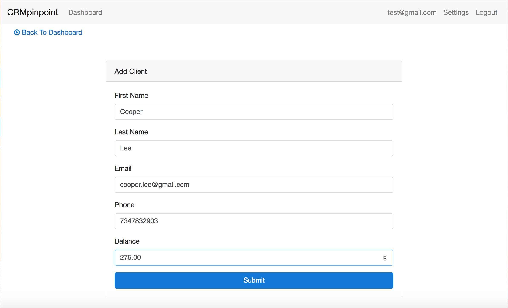
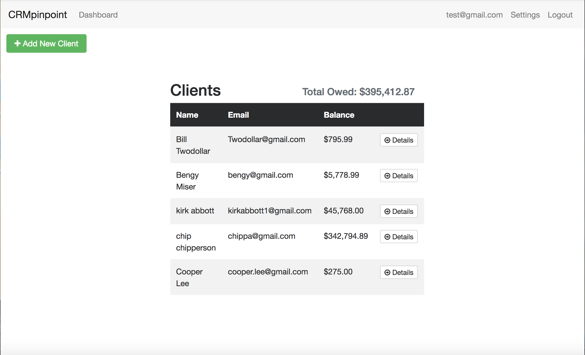

# CRMpinpoint

## Objective
Create a client management tracking directory app.

### Live Demo:

[CRMpinpoint](http://www.CRMpinpoint.com/)

### Credits

[Kirk Abbott](https://github.com/kirkabbott1)

### Languages / Frameworks / Technologies used:

* HTML
* CSS
* BOOTSTRAP
* Javascript
* Angular 4
* Firebase

## Description
Users can create an account, login, and keep track of clients and balance totals.

## Usage

1. Securely sign up and log in.

2. Add clients and balances to keep track of.

3. If you are an Admin, change settings to allow new users and money balance according to preferences.

4. Click on client details to see their info

5. Edit or delete client info/balance.

6. click the pencil edit next to balance to update balance.

7. go back to Dashboard with button or navbar.

### Screenshots

##### Register

  Email Address: test@gmail.com
  Password: password

  

##### Dashboard

  

##### Add New Client
  

##### Dashboard (Reflects New Client Added)

  

##### Client Details Page
  

##### Client Details Page (Update Balance)

  

##### Edit Client Details Page (Initial State: balance on edit is disabled)

  

##### Edit Client Details Page (Update Phone Number)
  

##### Client Details Page (Updated Phone Number)

  

##### Edit Settings Page (Initial State w/ disabled balance on edit)
  

##### Edit Settings Page (balance on edit is enabled)

  

##### Client Details Page

  

##### Edit Client Details Page (Initial State: balance on edit is enabled)
  

##### Edit Client Details Page (Initial State: balance on edit is enabled w/ updated balance)

  

###  Component Code Snippet


```
@Component({
  selector: 'app-client-details',
  templateUrl: './client-details.component.html',
  styleUrls: ['./client-details.component.css']
})
export class ClientDetailsComponent implements OnInit {
  id:string;
  client: Client;
  hasBalance:boolean = false;
  showBalanceUpdateInput:boolean = false;

  constructor(
    public clientService:ClientService,
    public router:Router,
    public route:ActivatedRoute,
    public flashMessagesService:FlashMessagesService
  ) { }

  ngOnInit() {
    // get id
    this.id = this.route.snapshot.params['id'];
    // get client
    this.clientService.getClient(this.id).subscribe(client => {
      if(client.balance > 0) {
        this.hasBalance = true;
      } else {
        this.hasBalance = false;
      }
      this.client = client;

    });
  }

  updateBalance(id:string){
    this.clientService.updateClient(this.id, this.client);
    this.flashMessagesService.show('Balance Updated', {cssClass:'alert-success', timeout: 3000});
      this.router.navigate(['/client/'+this.id]);

  }

  onDeleteClick(){
    if(confirm("Are you sure you want to delete?")) {
      this.clientService.deleteClient(this.id);
      this.flashMessagesService.show('Client Deleted', { cssClass: 'alerty-success', timeout: 3000 });
      this.router.navigate(['/']);
    }
  }
}
```

### Firebase service Snippet

```@Injectable()
export class ClientService {
  clients: FirebaseListObservable<any[]>;
  client: FirebaseObjectObservable<any>;

  constructor(
    public af:AngularFireDatabase    
  ) {
      this.clients = this.af.list('/clients') as FirebaseListObservable<Client[]>;
   }

   getClients() {
     return this.clients;
   }

  newClient(client:Client){
    this.clients.push(client);
  }

  getClient(id:string) {
    this.client = this.af.object('/clients/'+id) as FirebaseObjectObservable<Client>;
    return this.client
  }

  updateClient(id:string, client:Client){
    return this.clients.update(id, client);
  }

  deleteClient(id:string) {
    return this.clients.remove(id);
  }
}```
